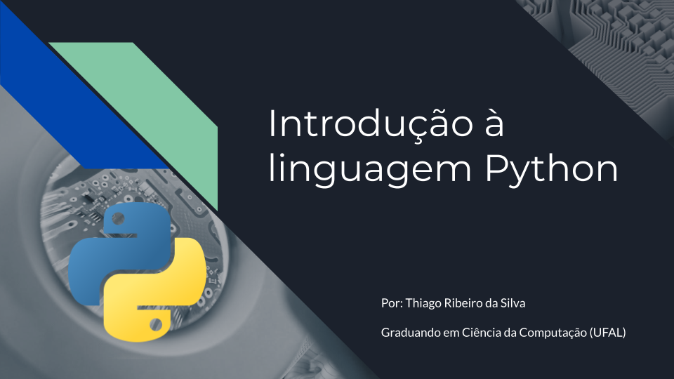

# Miniurso de Introdução à linguagem Python

Minicurso voltado a apresentação dos conceitos básicos da linguagem python, fundamentais para a compreensão da lógica de programação.

### Sumário:

- [Aula 00: Conceitos iniciais de programação](#aula-00-conceitos-iniciais-de-programação)
- [Aula 01: Primeiros passos com Python](#aula-01-primeiros-passos-com-python)
- [Aula 02: Módulos, Condicionais e Funções](#aula-02-módulos-condicionais-e-funções)
- [Aula 03: Estruturas de repetição (For e While)](#aula-03-estruturas-de-repetição-for-e-while)
- [Aula 04: Tuplas, Listas e dicionários | Parte 1](#aula-04-tuplas-listas-e-dicionários--parte-1)
- [Aula 05: Tuplas, Listas e dicionários | Parte 2](#aula-05-tuplas-listas-e-dicionários--parte-2)

### Aula 00: Conceitos iniciais de programação

Introdução ao significado de programação e linguagem de programação; Sintaxe e Semântica; Importância da programação e principais erros de iniciantes; Aplicações; Preparação do ambiente.

- [Slides](Aula_0/slide.pdf)

### Aula 01: Primeiros passos com Python

Entendendo o significado de variáveis; Conhecendo os tipos primitivos; Operadores aritméticos e de atribuição; Manipulação de strings; funções internas importantes.

- [Slides](/Aula_1/slide.pdf)
- [Exercícios](https://docs.google.com/document/d/1iAiZkwRIG9Do8VocORGxXQayb_zMcBiIOOafxmPq1OM/edit?usp=sharing)

### Aula 02: Módulos, Condicionais e Funções

Entendendo o conceito de módulos (bibliotecas); Math, Random, Time; Estrutura de condição e operadores condicionais e lógicos; Funções e noções de escopo.

- [Vídeo](https://drive.google.com/file/d/1gNQYI6I21FHckfe2dJaQ6H1ILJquT4rH/view?usp=share_link)
- [Slides](/Aula_2/slide.pdf)
- [Exercícios](https://docs.google.com/document/d/1KQ1tclyZ672e_DE8dyOM06YEqMgwMdEPTX4OL3Y-KIk/edit?usp=sharing)

### Aula 03: Estruturas de repetição (For e While)

Entendendo os conceitos de estruturas de repetição e suas peculiaridades e formas de uso em Python.

- [Vídeo](https://drive.google.com/file/d/1wHaUx7Qtg9qkZF34meHucfXVx-8nsp_f/view?usp=share_link)
- [Slides](/Aula_3/slide.pdf)
- [Exercícios](https://docs.google.com/document/d/15CMmbhA1HI9SGOAKbJID-L1NBSG9MRhwKobqx0wd45I/edit?usp=sharing)

### Aula 04: Tuplas, Listas e dicionários | Parte 1

Entendendo estruturas compostas (formadas pelo agrupamento de dados), suas propriedades e operações possíveis.

- [Slides](/Aula_4/slide.pdf)

### Aula 05: Tuplas, Listas e dicionários | Parte 2

Entendendo estruturas compostas (formadas pelo agrupamento de dados), suas propriedades e operações possíveis.

- [Vídeo](https://drive.google.com/file/d/17E1-2IIXNOBU6Od8qpZL6kbjHa13CNKE/view?usp=sharing)
- [Slides](/Aula_5/slide.pdf)
- Exercícios
### Colab das Aulas

Disponível [aqui](https://colab.research.google.com/drive/1wwKNSZr9MUzynch6EiYc11_27b4YKvUO?usp=sharing)
